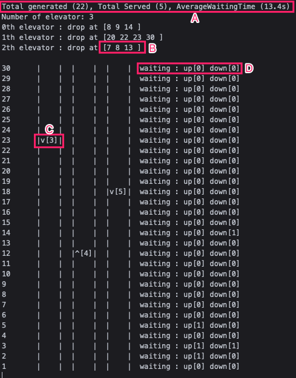

### ELEVATOR SIMULATOR

### HOW TO RUN

The visual studio project is in the zip file `cchen.zip`. You can unzip and run it. 

If you want to run it on mac, please use `codeRunner`. And change the `osType` in `main.cpp` to `0`.
> I have tested this program under mac `codeRunner`(using it own terminal) and windows `visual studio`(using default terminal), both are work well.
> 
> If you run this program in other system or other software, it may have pool display, because the console clean function in c++ varied in different os and terminal.

### DISPLAY

If you run this program successfully, you will see the console shows like this.

**A**: This is statistic data of the elevator and floor. The `total generated` means the total number of people been generated. `Total Served` means how many people have successfully get into their target floor.`AverageWaitingTime` means the average time between a person been generated and finally arrived in their target.

**B**: The floor number that people in this elevator want to go to. The size of it may smaller than the number of people in elevator, because there maybe two or more people target at same floor.

**C**: The Elevator. `v` means its going down, and the number aside means the current number of people in this elevator. `-` means wait. `^` means go up.

**D**: Means the number of people waiting at this floor push the up button or down button.

### OTHER

The console printer is designed as a individual thread and performed real time, so the display results may affected by the core number of the computer.

**The project design is different from the proposal, I redesign it.**
